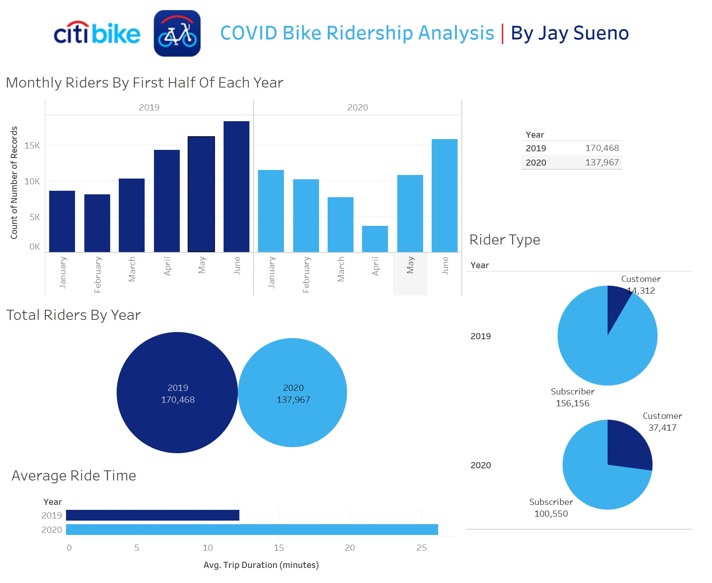
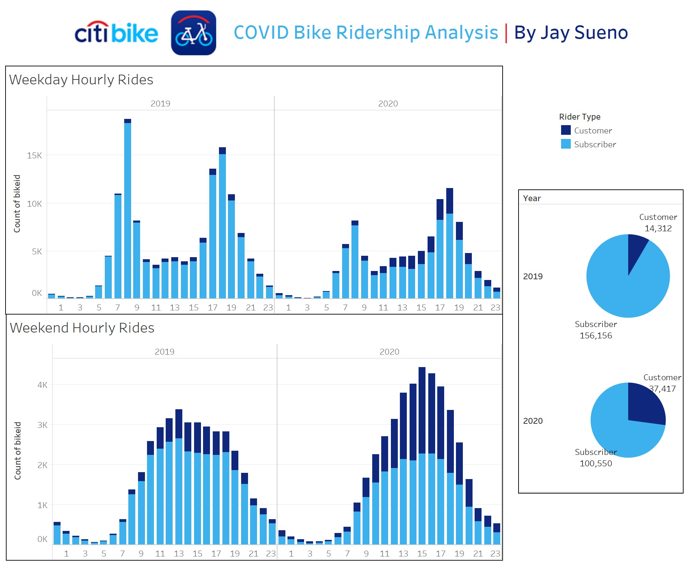
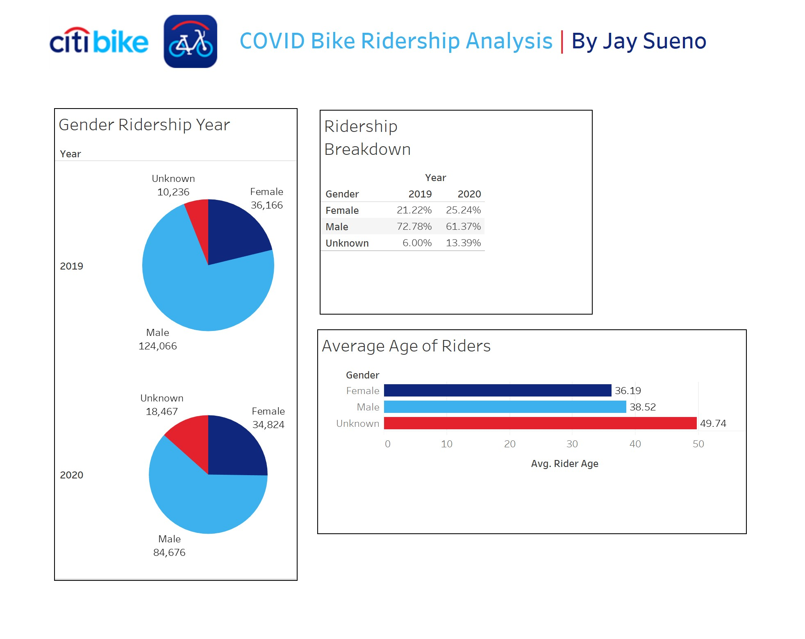
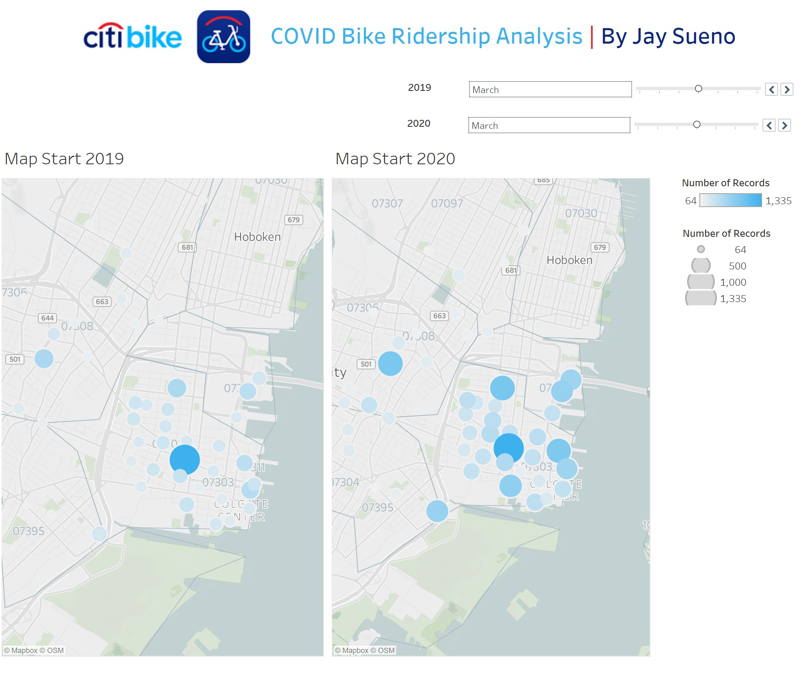
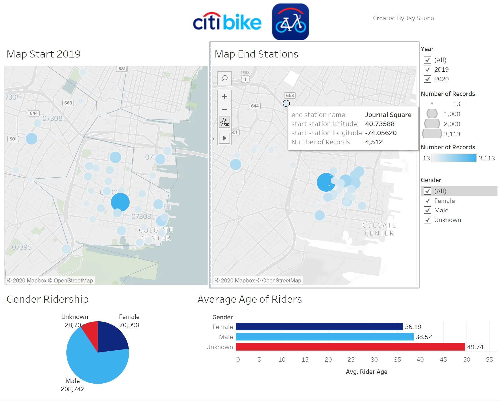

# Jersey City Biking Pattern Changes
### Written by Jay Sueno
_Tableau_

## Summary of Project
Tableau project to visualize how Jersey City biking patterns have changed in the time of Covid19. To view the Tableau visualization please visit my Tableau profile:

**[Tableau Jerskey City Covid19 CitiBike Rider Analysis](https://public.tableau.com/profile/joseph.sueno#!/vizhome/JerseyCityCitiBikeAnalysis2020/Story1)**

## Findings:

* Ridership has decreased during the initial months of COVID. It then seems to rebound back quite fast. This pattern mirrors quarentine restrictions and lifting of them. 
* The number "Customers" is a larger percentage of the total. This could be due to new riders. It could also be from people who don't want to ride the subway or a ride-share vehicle like Lyft.
* People are riding their bikes for longer times. This could be because it is now their perfered mode of transportation because it's open air vs enclosed like subways or cars. 

* Overall, riders on the weekdays have decreased, especially during rush hour times. This implies that less people are going to work. 
* The percentage of non-subscribers have increased. This is because there are possibly more riders who are switching from subway or ride-share apps like Lyft. It's known that there are higher rates of infection from enclosed spaces. Biking provides a great alternative because it's open air and socially distant. 
* Weekend ridership has increased in 2020. More people are recreating with bikes. This could be because its a socially distant acceptable activity.

* A notable change in ridership is that a higher percentage of riders in 2020 are women. Women accounted for 25.24% in 2020  up from 21.22% in 2019. While share of male ridership when from 72.78% down to 61.37% in 2020. The average age of riders, held relatively steady in both years.

* In this view we can slide the bars to the right to see a time lapse of ridership over the first 6 months in 2019 and 2020. Here we see that as the lockdown progressed, riding dispersed outside of the center of the city. It then rebounds as lockdown was lifted. 

* Here is an interactive map with the starting and end stations in Jersey City.

### About the Data

The data comes from the following website: [CitiBike Data Webpage](https://www.citibikenyc.com/system-data)

### To learn more about Jay Sueno visit his [LinkedIn Profile](https://www.linkedin.com/in/jaysueno)

##### All rights reserved 2020. All code is created and owned by Jay Sueno. If you use his code, please visit his LinkedIn and give him a a skill endorsement in python and data science. Visit him at: https://www.linkedin.com/in/jaysueno/